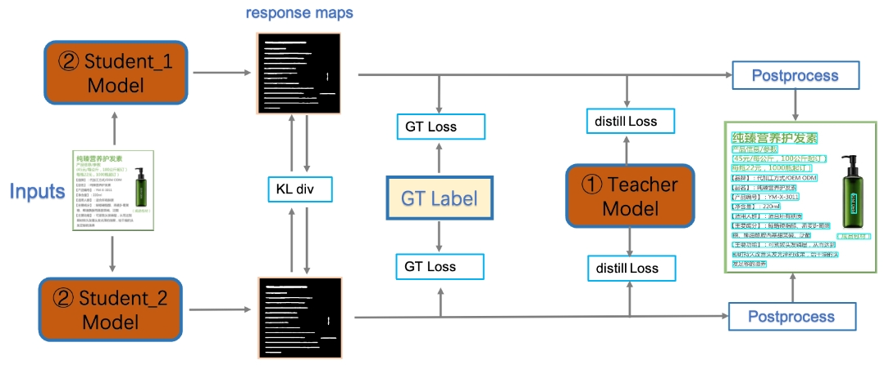
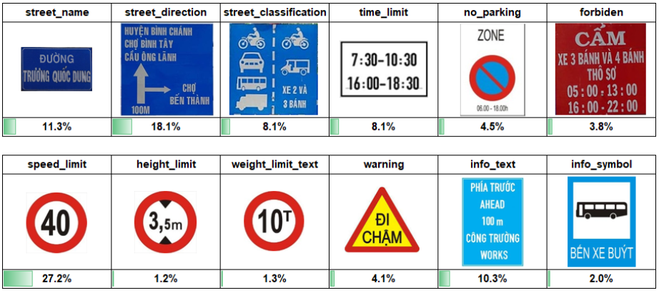
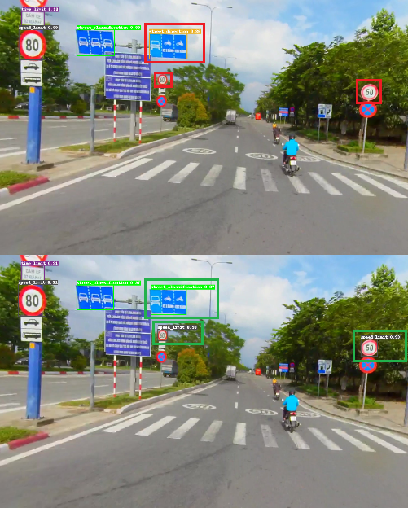

# Scene Text Detection for Driving Videos

<b>Abstract</b>
 
With the current trend of automation gradually dominating many aspects of human life, the demand for highly accurate and timely responsive automated systems has become essential. Specifically, in the context of transportation, self-driving vehicles, automated traffic monitoring and analysis systems require a capability to read and comprehend the traffic context at a given moment to make informed decisions. My research, "Scene Text Detection for Driving Videos", aims at supporting automated transportation systems in capturing textual information from traffic signs.

## System Pipeline

### Module 1: Detect and classify traffic signs

- Model: [**PP-YOLOE+**](https://github.com/PaddlePaddle/PaddleDetection/tree/release/2.7/configs/ppyoloe) from [**Paddle Detection**](https://github.com/PaddlePaddle/PaddleDetection/)

  
   
  <em><b>PP-YOLOE</b> architecture <a href="https://arxiv.org/abs/2203.16250">🡵</a></em>

### Module 2: Detect text box on traffic signs

- Model: [**PP-OCRv3 (detection)**](https://github.com/PaddlePaddle/PaddleOCR/blob/release/2.7/doc/doc_en/ppocr_introduction_en.md#pp-ocrv3) from [**Paddle OCR**](https://github.com/PaddlePaddle/PaddleOCR)
  - Using student model for lightweight inference

  
   
  <em><b>PP-OCRv3 (detection)</b> architecture <a href="https://arxiv.org/abs/2206.03001">🡵</a></em>

## Data

<table>
  <thead>
    <tr>
      <th>#</th>
      <th>Dataset</th>
      <th>Description</th>
      <th>Detail</th>
      <th>M1 Usage</th>
      <th>M2 Usage</th>
    </tr>
  </thead>
  <tbody>
    <tr>
      <td>#1</td>
      <td><b><a href="https://github.com/Flavius1996/VNTS-faster-rcnn">Vietnam Traffic Signs Dataset</a></b></td>
      <td>Open source recorded traffic videos around Ho Chi Minh City</td>
      <td>40 videos (total length: 1h24m44s)</td>
      <td>Fine-tuning + Testing</td>
      <td>Fine-tuning + Testing</td>
    </tr>
    <tr>
      <td>#2</td>
      <td><b><a href="https://openaccess.thecvf.com/content/CVPR2021/html/Nguyen_Dictionary-Guided_Scene_Text_Recognition_CVPR_2021_paper.html">VinText</a></b></td>
      <td>Largest Vietnamese Scene text dataset</td>
      <td>2,000 labeled images, ~56,000 text objects (~10,500 unique objects)</td>
      <td>Testing</td>
      <td>Fine-tuning + Testing</td>
    </tr>
    <tr>
      <td>#3</td>
      <td><b><a href="https://challenge.zalo.ai/portal/traffic-sign-detection">Zalo AI Challenge - Traffic Sign Detection Dataset</a></b></td>
      <td>Zalo AI Challenge dataset for “Traffic Signs Detection" contest in 2020 with image data collected from Google Map Street View</td>
      <td>~8,000 traffic images with traffic sign labels</td>
      <td>Testing</td>
      <td>Testing</td>
    </tr>
    <tr>
      <td>#4</td>
      <td><b>Extra</b></td>
      <td>Self collected dataset around Ho Chi Minh City</td>
      <td>198 images, 393 traffic sign objects</td>
      <td>Improved Fine-tuning + Testing</td>
      <td>Testing</td>
    </tr>
  </tbody>
</table>

### Customized Vietnam Traffic Signs Dataset (Customized VTSD)

Since Dataset #1 was used in another project with different output, we need to re-process Dataset #1 to match with our project target

- Splitting and filtering images from raw videos
- Using [**CVAT**](https://app.cvat.ai/) to label traffic signs and text
- Label statistics:

<table>
  <tbody>
    <tr>
      <td rowspan="5">
        <b># of</b>
      </td>
      <td>Images</td>
      <td>296</td>
    </tr>
    <tr>
      <td>Traffic sign objects</td>
      <td>603</td>
    </tr>
    <tr>
      <td>Traffic sign classes</td>
      <td>12</td>
    </tr>
    <tr>
      <td>Word objects</td>
      <td>1,538 (274 unique words)</td>
    </tr>
    <tr>
      <td>Textline objects</td>
      <td>628</td>
    </tr>
  </tbody>
</table>

  
   
  <em>Traffic sign classes and data distribution</em>

## Fine-tune

<table>
  <thead>
    <tr>
      <th>Module</th>
      <th>Model</th>
      <th>Pre-trained dataset</th>
      <th>Fine-tuned dataset</th>
      <th>Performance</th>
      <th>FPS</th>
    </tr>
  </thead>
  <tbody>
    <tr>
      <td>#1</td>
      <td><a href="https://github.com/PaddlePaddle/PaddleDetection/tree/release/2.7/configs/ppyoloe">PP-YOLOE+</a></td>
      <td><a href="http://openaccess.thecvf.com/content_ICCV_2019/papers/Shao_Objects365_A_Large-Scale_High-Quality_Dataset_for_Object_Detection_ICCV_2019_paper.pdf">Objects365</a></td>
      <td>Customized VTSD</td>
      <td>mAP: ~0.677</td>
      <td>~18.3</td>
    </tr>
    <tr>
      <td>#2</td>
      <td><a href="https://github.com/PaddlePaddle/PaddleOCR/blob/release/2.7/doc/doc_en/ppocr_introduction_en.md#pp-ocrv3">PP-OCRv3 (detection)</a></td>
      <td><a href="https://arxiv.org/abs/2206.03001">Baidu images + public datasets</a></td>
      <td>Customized VTSD + <a href="https://openaccess.thecvf.com/content/CVPR2021/html/Nguyen_Dictionary-Guided_Scene_Text_Recognition_CVPR_2021_paper.html">VinText</a></td>
      <td>H-mean: ~0.82</td>
      <td>~29.5</td>
    </tr>
  </tbody>
</table>

- Improving M1 performance by combine Dataset #4 into Customized VTSD:
  - Total number of images and number of traffic sign objects increase by ~40%
  - After improved mAP: ~0.69

  
   
  <em>Improvement sample</em>

## Video output samples

<table>
  <tbody>
    <tr>
      <td>#1</td>
      <td></td>
    </tr>
    <tr>
      <td>#2</td>
      <td></td>
    </tr>
    <tr>
      <td>#3</td>
      <td></td>
    </tr>
  </tbody>
</table>

## Future works

- Fine-tuning and combine Scene text recognition module into the system
- Building an End-to-end model based on Transformer
- Developing a web application for demonstration