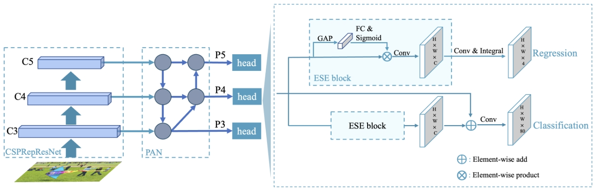
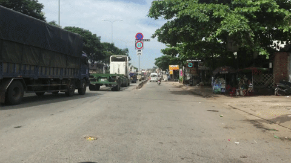
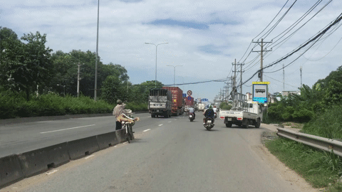
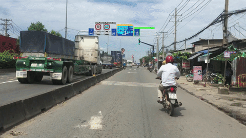

# Scene Text Detection for Driving Videos

<b>Abstract</b>
 
With the current trend of automation gradually dominating many aspects of human life, the demand for highly accurate and timely responsive automated systems has become essential. Specifically, in the context of transportation, self-driving vehicles, automated traffic monitoring and analysis systems require a capability to read and comprehend the traffic context at a given moment to make informed decisions. My research, "Scene Text Detection for Driving Videos", aims at supporting automated transportation systems in capturing textual information from traffic signs.

## System Pipeline

### Module 1: Detect and classify traffic signs

- Model: [**PP-YOLOE+**](https://github.com/PaddlePaddle/PaddleDetection/tree/release/2.7/configs/ppyoloe) from [Paddle Detection](https://github.com/PaddlePaddle/PaddleDetection/)

<figure style="width:90%">
  
  
PP-YOLOE architecture <a href="https://arxiv.org/abs/2203.16250">🡵</a>

</figure>

### Module 2: Detect text box on traffic signs

- Model: [**PP-OCRv3**](https://github.com/PaddlePaddle/PaddleOCR/blob/release/2.7/doc/doc_en/ppocr_introduction_en.md#pp-ocrv3) from [Paddle OCR](https://github.com/PaddlePaddle/PaddleOCR)

## Data

<table>
  <thead>
    <tr>
      <th>#</th>
      <th>Dataset</th>
      <th>Description</th>
      <th>Detail</th>
      <th>M1 Usage</th>
      <th>M2 Usage</th>
    </tr>
  </thead>
  <tbody>
    <tr>
      <td>#1</td>
      <td><b>Vietnam Traffic Signs Dataset</b></td>
      <td>Open source recorded traffic videos around Ho Chi Minh City</td>
      <td>40 videos (total length: 1h24m44s)</td>
      <td>Finetuning + Testing</td>
      <td>Finetuning + Testing</td>
    </tr>
    <tr>
      <td>#2</td>
      <td><b>VinText</b></td>
      <td>Largest Vietnamese Scene text dataset</td>
      <td>2,000 labeled images, ~56,000 text objects (~10,500 unique objects)</td>
      <td>Testing</td>
      <td>Finetuning + Testing</td>
    </tr>
    <tr>
      <td>#3</td>
      <td><b>Zalo AI Challenge - Traffic Sign Detection Dataset</b></td>
      <td>Zalo AI Challenge dataset for “Traffic Signs Detection" contest in 2020 with image data collected from Google Map Street View</td>
      <td>~8,000 traffic images with traffic sign labels</td>
      <td>Testing</td>
      <td>Testing</td>
    </tr>
    <tr>
      <td>#4</td>
      <td><b>Extra</b></td>
      <td>Self collected dataset around Ho Chi Minh City</td>
      <td>198 images, 393 traffic sign objects</td>
      <td>Improved Finetuning + Testing</td>
      <td>Testing</td>
    </tr>
  </tbody>
</table>

## Samples

<table>
  <tbody>
    <tr>
      <td>#1</td>
      <td></td>
    </tr>
    <tr>
      <td>#2</td>
      <td></td>
    </tr>
    <tr>
      <td>#3</td>
      <td></td>
    </tr>
  </tbody>
</table>
